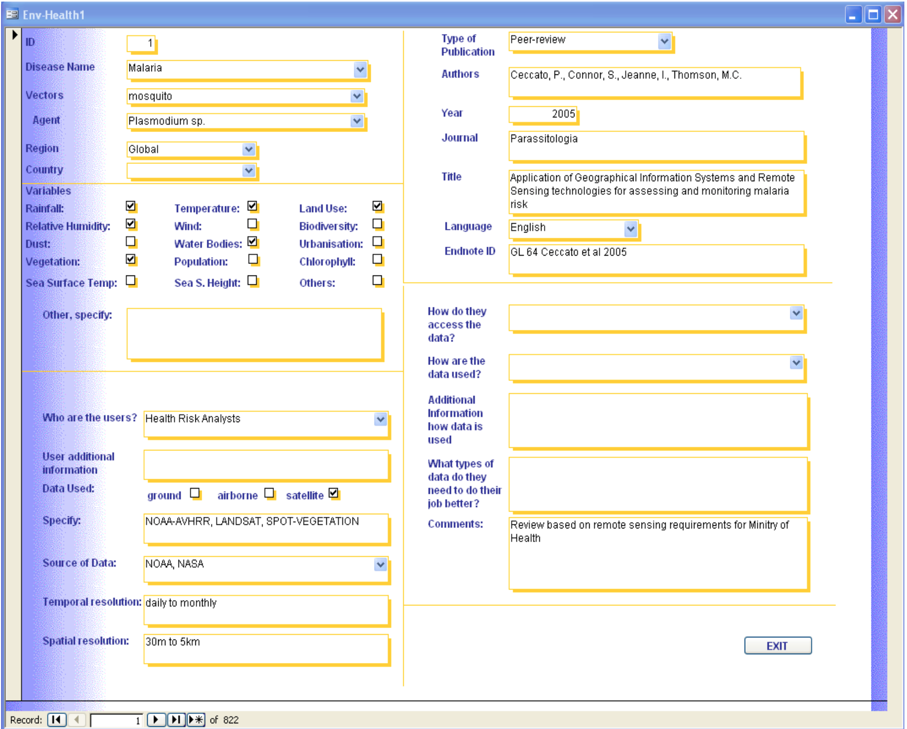

== Initiatives

The following initiatives (including standards and projects) were investigate for the purpose of extracting patterns and best practices to build the Health Spatial Data Infrastructure.

[#geo-Task-eo-health]
=== GEO Task US-09-01a Critical Earth Observations Priorities for Health Societal Benefit Area: Infectious
Experts under the Group on Earth Observations (GEO) supported the development of a study (cite:[RN760]) to identify Earth Observations required to support a (https://sbageotask.larc.nasa.gov/humanhealth.html[Health Societal Benefit Area (Health SBA)]) under Task US-09-01a. The Health SBA was separated into three areas dealing with: 

1.	Air Quality – focusing on air pollutants that have damaging effects on human health
2.	Aeroallergens – focusing on airborne substances such as pollen and spores
3.	Infectious Disease – focusing diseases influenced by climate and environmental factors 

Three teams documented requirements for Earth Observation in each of these areas.

[[eo-diseases-img]]
.Database of Relations of Earth Observation Data and Diseases

[#eo4health]
=== EO4HEALTH
Earth Observations for Health (http://www.earthobservations.org/activity.php?id=143[EO4HEALTH])  is a community activity under the GEO 2017-2019 Work Program. Its goal is the advancement of integrated information systems to reduce environmental health related risks. It focuses on:

*  Weather and climate extremes (e.g., heat)
*  Water-related illness (e.g., cholera)
*  Vector borne disease (e.g., dengue, malaria)

[#eo2heaven]
=== EO2 Heaven

http://www.opengeospatial.org/projects/initiatives/eo2heaven[EO2HEAVEN] was  funded by European Commission 7th Framework Program to advance better understanding of the complex relationships between environmental changes and their impact on human health. The project advanced a system architecture and developed  applications related to changes induced by human activities, with emphasis on atmospheric, river, lake and coastal marine pollution. The project provided recommendations on standards-based Spatial Information Infrastructure (SII) to support research of human exposure and early detection of infections (cite:[RN761]).

[#cgdi]
=== CGDI

The http://www.nrcan.gc.ca/earth-sciences/geomatics/canadas-spatial-data-infrastructure/10783[Canadian Geospatial Data Infrastructure (CGDI)] implements a framework for data sharing and data integration by using standard based technologies. It has adopted many specifications addressed by ISO/TC211, OGC, FGDC and W3C in describing, publishing, visualizing, accessing and manipulating geospatial resources, such as Catalog services interface, Web Map Service (WMS), Styled Layer Descriptor (SLD), Web Feature Service (WFS), Web Processing Service (WPS). These services can be chained together to implement complex tasks by the defining of the workflow process, as was done in a pandemic simulation in 2007 funded by GeoConnections and the USGS [#need reference to this simulation#].

[#inspire-health-specs]
=== INSPIRE Human Health and Safety Data Specifications
The http://inspire.ec.europa.eu/[Infrastructure for spatial information in Europe] has defined the http://inspire.ec.europa.eu/Themes/119/2892[Human Health and Safety] theme, including technical guidelines for data specifications (cite:[RN762]). For example, it provides a conceptual model for the sharing of health data (See figure <<inspire-health-stats-img>>).

[[inspire-health-stats-img]]
.INSPIRE UML class for health statistical data
image::images/inspire-health-stats.png[width=800]

[#geo-darma]
=== GEO-DARMA
The https://www.earthobservations.org/activity.php?id=110[Data Access for Risk Management (DARMA)] initiative aims to increase the availability and accuracy of risk related information to allow decision-makers to simulate the impact of risk-reduction measures and make informed decisions about risk reduction investment. The type of risk information useful to decision-makers depends on the geographical location, the type of risk affecting the region, the local policies, and more. https://www.earthobservations.org/activity.php?id=49[GEO-DARMA]  addresses several articles of the Sendai Framework such as articles 24 and 25 that calls for the "promotion and enhancement through International cooperation, including technology transfer, (of) access to and use of non sensitive data, information, as appropriate, communications and geospatial and space-based technologies and related services." GEO-DARMA will define end-to-end solutions that foster use of accurate Earth Observation data risk information products and services for evidence-based decision-making.

[#linked-open-data-gdr]
=== LODGD

The group http://www.codata.org/task-groups/linked-open-data-for-global-disaster-risk-research[Linked Open Data for Global Disaster Risk (LODGD)], as part of the interdisciplinary Committee on Data for Science and Technology (CODATA), aims to address the challenge of management and integration of  disaster-related data for research and policy making. In its first white paper publication (cite:[RN763]), the group highlighted the importance of data interconnectivity from different scientific disciplines such as hydrology, meteorology, climate, civil engineering, land use, and public health. CODATA is in process of producing a second white paper related to a Next Generation Spatial Data Infrastructure (NG-SDI).

[#irdr-data]
=== IRDR-DATA
The http://www.irdrinternational.org/projects/data/[Disaster Loss Data (DATA)] project, under the umbrella of the Integrated Research on Disaster Risk (IRDR) program, brings together stakeholders from different disciplines and sectors to study issues related to the collection, storage, and dissemination of disaster of loss data,
[#not sure how relevant is this to this paper#]

[#eccma]
=== ECCMA ePROP
#not sure how relevant is this to this paper#

[#mesh]
=== MeSH
The https://www.nlm.nih.gov/mesh/[Medical Subject Headings (MeSH)] is the US National Library of Medicine's thesaurus. It provides a controlled vocabulary  of terminology  useful for indexing and cataloging biomedical and pharmaceutical information.

[#snomed]
=== SNOMED
The https://www.nlm.nih.gov/healthit/snomedct/[Systematized Nomenclature of Medicine (SNOMED)] provides a comprehensive controlled vocabulary for terms related to anatomy, diseases, findings, procedures, microorganisms, substances and other topics. It is used by the U.S. Federal Government systems for the electronic exchange of clinical health information.

[#umls]
===  UMLS
The https://www.nlm.nih.gov/research/umls/[Unified Medical Language System (UMLS)] provides controlled vocabularies for biomedical information and health records. Useful applications build with UMLS can enable linking of records (via codes or terms) between doctor's, care centers, pharmacies, and  insurance companies.

=== UNCAP
#can't find this reference#

[#agewell]
=== AGEWELL
#can't find this reference#
