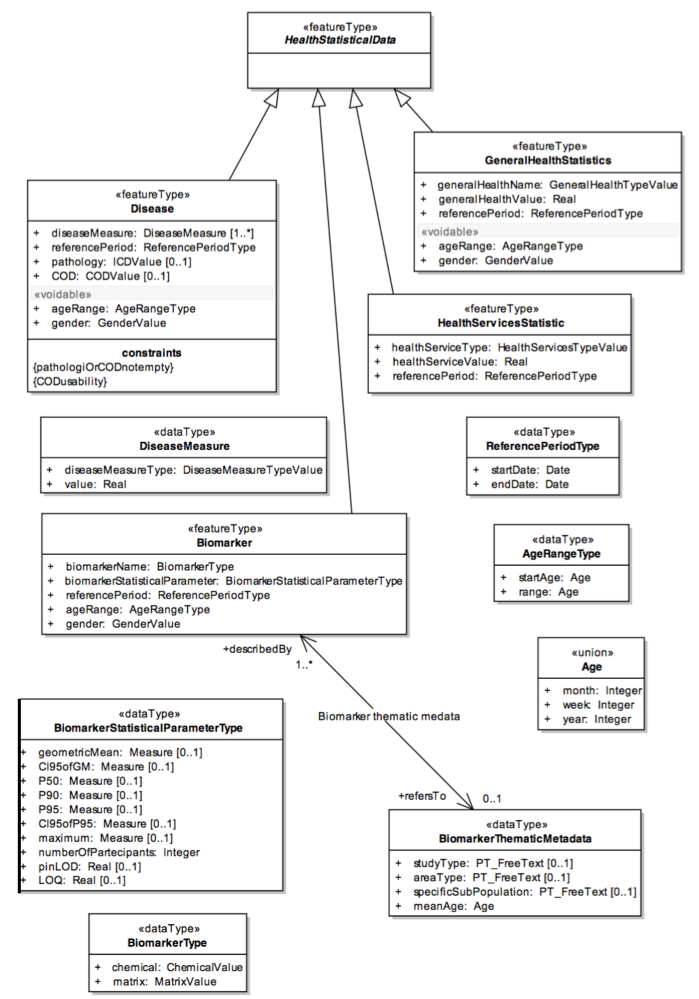

== Initiatives

Numerous initiatives (including standards and projects) within the health and geospatial domain can provide patterns and best practices for the building of a Health Spatial Data Infrastructure. Several were reviewed for this purpose and are discuss below. 

[#geo-Task-eo-health]
=== GEO Task US-09-01a Critical Earth Observations Priorities for Health Societal Benefit
Experts under the https://www.earthobservations.org/index.php[Group on Earth Observations (GEO)] supported the development of a study (cite:[RN760]) to identify Earth Observations required to support a https://sbageotask.larc.nasa.gov/humanhealth.html[Health Societal Benefit Area (Health SBA)] under Task US-09-01a. The Health SBA was separated into three areas dealing with: 

1.	Air Quality – focusing on air pollutants that have damaging effects on human health
2.	Aeroallergens – focusing on airborne substances such as pollen and spores
3.	Infectious Disease – focusing diseases influenced by climate and environmental factors 

Three teams documented requirements for Earth Observation in each of these areas.

[#eo4health]
=== EO4HEALTH
Earth Observations for Health (http://www.earthobservations.org/activity.php?id=143[EO4HEALTH])  is a community activity under the GEO 2017-2019 Work Program. Its goal is the advancement of integrated information systems to reduce environmental health related risks, focusing on:

*  Weather and climate extremes (e.g., heat)
*  Water-related illness (e.g., cholera)
*  Vector borne disease (e.g., dengue, malaria)

An https://www.earthobservations.org/documents/gwp20_22/eo_for_health_ip.pdf[Implementation Plan] for years 2020-2022 was developed in March 2019. 

[#eo2heaven]
=== EO2 Heaven

http://www.opengeospatial.org/projects/initiatives/eo2heaven[EO2HEAVEN] was funded by European Commission 7th Framework Program to advance understanding of the complex relationships between environmental changes and their impact on human health. The project advanced a system architecture and developed applications related to changes induced by human activities, with emphasis on atmospheric, river, lake, and coastal marine pollution. Recommendations on standards-based Spatial Information Infrastructure (SII) to support research of human exposure and early detection of infections (cite:[RN761]) was provided.

The project started on February 1, 2010 and ended on May 31, 2013 with results published in a publication called https://www.iosb.fraunhofer.de/servlet/is/26790/D6.10_EO2HEAVEN_Book.pdf[EO2HEAVEN - Mitigating Environmental Health Risks]. The case studies that were examined were the impact of air quality on respiratory and cardiovascular diseases; relationship between industrial pollutant exposure and adverse respiratory outcomes; and the links between environmental variables and cholera. 

[#cgdi]
=== CGDI

The http://www.nrcan.gc.ca/earth-sciences/geomatics/canadas-spatial-data-infrastructure/10783[Canadian Geospatial Data Infrastructure (CGDI)] implements a framework for data sharing and data integration by using standard based technologies. It has adopted many specifications addressed by the OGC, the Federal Geographic Data Committee (FGDC), the World Wide Web Consortium (W3C), and the ISO/TC211 standards committee on Geographic Information/Geomatics in describing, publishing, visualizing, accessing and manipulating geospatial resources, such as Catalog services interface, Web Map Service (WMS), Styled Layer Descriptor (SLD), Web Feature Service (WFS), and Web Processing Service (WPS) among others. These services can be chained together to implement complex tasks by defining a workflow, as was done in a pandemic simulation in 2007 funded by GeoConnections and the U.S. Geological Survey (USGS).

The collaboration between different governmental entities ensure interoperability for the CDGI. The GeoConnection program’s http://publications.gc.ca/collections/collection_2016/rncan-nrcan/M104-8-2012-eng.pdf[3 phases], listed below, were completed as of 2015: 

1.	Establish and Build – to build the infrastructure of the CGDI
2.	Evolve and Expand – focused on promoting the CGDI among user communities
3.	Integrate and Sustain – developed the CGDI’s policies and procedures and addressing sustainability.  

In https://geoscan.nrcan.gc.ca/starweb/geoscan/servlet.starweb?path=geoscan/downloade.web&search1=R=297880[2015], an assessment was done to see how the CDGI presented data to various government agencies. The finding determined that there was an increased use in the CDGI but with only an 80% implementation success rate. The goal was to implement it to a full 100% success rate. In https://geoscan.nrcan.gc.ca/starweb/geoscan/servlet.starweb?path=geoscan/downloade.web&search1=R=314606[2018], another study was conducted to establish improvement potential to the CGDI. The results presented that many organizations where not using complete CGDI services. Going forward, many organizations will develop a workflow to incorporate CGDI into their data infrastructure.

In earlier work supported by the CGDI, a Health Representation XML (HERXML) schema was designed that consists of semantic, geometric, and cartographic representation of health data. HERXML enables web-based visual representation of health data to support, among other applicaitons, policy makers and health planning efforts. 

[#inspire-health-specs]
=== INSPIRE Human Health and Safety Data Specifications
The http://inspire.ec.europa.eu/[Infrastructure for spatial information in Europe] has defined the http://inspire.ec.europa.eu/Themes/119/2892[Human Health and Safety] theme, including technical guidelines for data specifications, as shown in Figure 1. (cite:[RN762]). INSPIRE has been https://inspire.ec.europa.eu/INSPIRE-in-your-Country[implemented] across the 28 member countries of the European Union (EU); European Free Trade Association member countries Iceland, Norway, Switzerland, and Liechtenstein; as well as the non-member states of North Macedonia, Servia, and Turkey. 

[[inspire-health-stats-img]]
.INSPIRE UML class for health statistical data

[#geo-darma]
=== GEO-DARMA
The https://www.earthobservations.org/activity.php?id=110[Data Access for Risk Management (DARMA)] initiative aims to increase the availability and accuracy of risk related information to allow decision-makers to simulate the impact of risk reduction measures and make informed decisions about risk reduction investment. The type of risk information useful to decision makers depends on the geographical location, the type of risk affecting the region (e.g., weather, natural disaster, and rapid urbanization), local policies, and more. https://www.earthobservations.org/activity.php?id=49[GEO-DARMA] addresses several articles of the Sendai Framework such as articles 24 and 25 that calls for the "promotion and enhancement through International cooperation, including technology transfer, (of) access to and use of non-sensitive data, information, as appropriate, communications and geospatial and space-based technologies and related services." GEO-DARMA will define end-to-end solutions fostering the use of accurate Earth Observation data risk information products and services for evidence-based decision making.

GEO-DARMA is one of the major initiatives that is supported by space agencies as a follow-on action to the Sendai Framework for Disaster Risk Reduction 2015-2030.  Their https://www.earthobservations.org/activity.php?id=110[long-term goal] is to use EO data and EO-based risk information to increase awareness with donor agencies like The World Bank of the promise of EO solutions. There are http://ceos.org/ourwork/workinggroups/disasters/geo-darma/[3 phases] beginning with a Concept Phase and continuing to a Prototyping Phase, that aims to establish demonstrations in representative areas of the added value of using satellite data for multi-hazard DRR in an international context. The third and final phase is an Operational Phase in which GEO-DARMA is a selecting on a case-by-case basis the projects to move towards operations based on their benefits to stakeholders and sustainability. 

[#linked-open-data-gdr]
=== LODGD
The http://www.codata.org/task-groups/linked-open-data-for-global-disaster-risk-research[Linked Open Data for Global Disaster Risk (LODGD)] group, as part of the interdisciplinary http://www.codata.org/[Committee on Data for Science and Technology (CODATA)], aims to address the challenge of management and integration of disaster-related data for research and policy making. This Task Group has produced http://www.codata.org/task-groups/linked-open-data-for-global-disaster-risk-research[three white papers] on this topic. In its first white paper publication (cite:[RN763]), the group highlighted the importance of data interconnectivity from different scientific disciplines such as hydrology, meteorology, climate, civil engineering, land use, and public health. CODATA produced a second white paper, titled http://www.irdrinternational.org/2019/09/17/next-generation-disaster-data-infrastructure/[“Next Generation Disaster Data Infrastructure”] stated the importance of developing an infrastructure that includes information system and services that a region can depend on to gather, process, and display disaster data to reduce the impact of natural disasters. A third expected white paper on “National Policy Study on Disaster Data around the World” is set to be published sometime in 2019.

[#irdr-data]
=== IRDR-DATA
The http://www.irdrinternational.org/projects/data/[Disaster Loss Data (DATA)] project, under the umbrella of the http://www.irdrinternational.org/what-we-do/overview/[Integrated Research on Disaster Risk (IRDR)] program, brings together stakeholders from different disciplines and sectors to study issues related to the collection, storage, and dissemination of disaster of loss data. A http://www.irdrinternational.org/2019/09/17/next-generation-disaster-data-infrastructure/[white paper] was published established the need of disaster data collection and a data base to visualize the data. 

[#mesh]
=== MeSH
The https://www.nlm.nih.gov/mesh/[Medical Subject Headings (MeSH)] is the US National Library of Medicine's thesaurus. It provides a controlled vocabulary of terminology useful for indexing and cataloging biomedical and pharmaceutical information.

[#snomed]
=== SNOMED
The https://www.nlm.nih.gov/healthit/snomedct/[Systematized Nomenclature of Medicine (SNOMED)] provides a comprehensive controlled vocabulary for terms related to anatomy, diseases, findings, procedures, microorganisms, substances, and other topics. It is used by the U.S. Federal Government systems for the electronic exchange of clinical health information.

[#umls]
===  UMLS
The https://www.nlm.nih.gov/research/umls/[Unified Medical Language System (UMLS)] provides controlled vocabularies for biomedical information and health records. Useful applications build with UMLS can enable linking of records (via codes or terms) between doctor's, care centers, pharmacies, and insurance companies.

