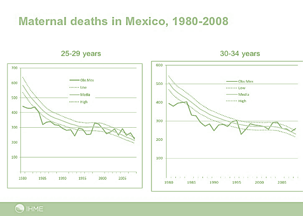

[[Introduction]]
== Application Areas

Development of a Health SDI requires understanding of the use cases that the SDI should support. The following use cases are included in this document:

* Climate Health
* Healthy Aging
* Health in the Smart City
* Disaster Resilience 
* Global Indicators
* Maternal Mortality

== Climate Health

Climate variability can pose significant threats to human health and well-being in the form of higher temperatures, increased extreme weather events, such as hurricanes and wildfires, decreased air quality, water shortages, and illnesses transmitted by food, water, and disease carriers such as mosquitoes and ticks. Extreme storms and temperatures can also disrupt the delivery of health services by causing damage to roads and transportation infrastructure, hospitals, clinics, wastewater treatment plants, and other facilities. Climate variability can also impact economic sectors that support health, such as energy, transportation, and agriculture. 

As a case in point, there are many individuals in the U.S. who depend on electrically powered, life-saving medical devices, such as ventilators, cardiac devices, and home dialysis machines. These individuals depend on the medical devices to function properly, and therefore also depend on available and continuous electrical power. The U.S. Department of Health and Human Services (HHS) produces an https://empowermap.hhs.gov/[emPOWER map] (shown below) that provides a visualization by region (state, county, or ZIP Code level) as well as the specific number of people in tabular form of those who depend on such devices. For instance, the U.S. state of Georgia is home to 77,930 such individuals.

.emPOWER map for the U.S. state of Georgia.
image::images/emPower Georgia.png[width=800]

A Health SDI could help in the development of new ways to monitor, prevent, and respond to climate impacts on human health. Steps taken to prepare for climate impacts can improve health and provide other societal benefits, such as sustainable development, disaster risk reduction, and improvements in quality of life.

Applications arising from a Health SDI could help health authorities publish up-to-date maps showing various dimensions of disease, population health, and environment. Economies of scale can be leveraged when epidemiological research and health planning communities utilize a coordinated system to address inequalities in and stresses on health systems and healthcare provision, access, and promotion. Applications can be scaled up to support more sophisticated climate-health scenarios, particularly during health emergencies and for pandemic response efforts.

Research collaboratives such as the http://lancetcountdown.org/[Lancet Countdown] can also inform framework development. The Lancet Countdown tracks the world’s response to climate change and health benefits that may emerge from this response. This reporting is done annually, and different indicators are evaluated and changed as needed. The Countdown proposes five thematic breakdowns:

*	Climate change impacts, exposures and vulnerability;
*	Adaption planning and resilience for health;
*	mitigation action and health co-benefits;
*	Economics and finance; and
*	Political and broader engagement.

These thematic breakdowns, along with associated indicator domains, could be used to provide organizing principles for a health SDI or perhaps even for the overall spatial information framework itself. There were 40 indicators in 2017. In 2018, a https://sciencepolicy.colorado.edu/admin/publication_files/2018.14.pdf[revision of the indicators] led to the inclusion of a new indicator under the Public and Political Engagement breakdown called Corporate Sector Engagement in Health and Climate Change. The list of indicators from 2017 and 2018 appear in the Appendix.

=== Paris Agreement on Climate Change

The https://unfccc.int/process-and-meetings/the-paris-agreement/the-paris-agreement[Paris Agreement on Climate Change] was held in December 2015, at the http://www.cop21paris.org/[2015 UN Climate Change Conference (CoP21)], held in Paris, France. It highlighted that mitigating Green House Gas (GHG) emissions and air pollution can reduce health impacts and costs. There will be a global assessment every 5 years to assess the collective progress toward achieving the purpose of the agreement and the inform other parties of individual actions.

== Health Aging

Some populations are more vulnerable than others to changes in health status. Vulnerable populations of concern include children, pregnant women, those with low income, immigrant groups, indigenous peoples, communities of color, as well as older adults. It is well known that the bulk of the healthcare expenditure goes towards care for senior populations. In the U.S., 36% of healthcare spending is attributed to the 65 and over population, even though they make up only 16% of the U.S. population.   

In order to address and reduce the vulnerability of aging populations, health organizations are increasingly turning to geospatial analysis to assess and prioritize areas for intervention based on location.

=== Geospatial Tech to Address Costs

Geospatial tools linking social determinants of health (SDoH) with health conditions, outcomes, and costs associated with the elderly can identify those social factors that are root causes of or influencers of poor health outcomes, and their associated high costs. Identifying root causes of poor health outcomes of the elderly populations will allow health systems, working within their communities, to address the underlying social factors and achieve improved health and quality of life for those communities. 

=== Mobility and Ease of Access

Mobility and simply “getting around” are often reported as challenges for the elderly population. Limited mobility often leads to isolation, which in turn can cause and exacerbate many health conditions. Geospatial technology can address mobility issues in part by assessing and rating parks, public areas, and internal building structures on ease of mobility, such as the presence or absence of elevators, hand-rails on stairwells, ramps in place of steps for short elevations, as well as other health-related issues such as mold, temperature, air quality, etc. 

Geospatial technology can also identify gradations in topology and elevation in public parks or city-wide areas to provide information on walking tracks. 

== Health in the Smart City

Growth in the proportion of urban residents making up the global population can impact environmental sustainability, the availability and effectiveness of public services, economic growth and social resilience. Effective integration of human, physical, and digital systems would enable cities to be more prosperous, sustainable and resilient.

The World Health Organization (WHO) https://www.who.int/healthy_settings/types/cities/en/[Healthy Cities project] brings together hundreds of cities under its network to make health a priority on economic, social, and political agendas. Boulus discussed the importance of https://ij-healthgeographics.biomedcentral.com/articles/10.1186/1476-072X-13-10[Internet of Things (IoT)] and geospatial analytics empowering healthy city decisions. One example is the wireless sensors connected to garbage bins to monitor trash levels in Barcelona. This not only provides data for optimization of data collection but can help minimize pollution and sanitation related illnesses. One could theorize that trash routes could be optimized to address the heaviest use garbage bins and best avoid any overflow. Overflowing waste containers can cause bacteria to grow, pollute air and water sources, and cause respiratory diseases, salmonella, and fever among others.

Mobile Health in an information technology field that advances the use of mobile devices to support health services and information. Information from mobile health and smart cities can improve healthcare and overall quality of life. 

https://www.information-age.com/smart-city-technology-123473905/[Smart Cities] provide an exciting opportunity to continue and further drive advancements in the delivery of public services improving human life. Distributed Internet-of-Things and Internet-of-Medical-Things sensors on wearables, mobile medical devices, and even perhaps implantables together with a Smart City infrastructure allow for new means of gathering data on all aspects of life-in-the-city and provide health systems new and innovative means of responding to the specific needs of individual patients.

As another example, a Smart City can provide real-time monitoring of occupancy levels of inpatient and emergency room hospital beds, current stock of key medical supplies, and current clinical staffing levels at hospitals and other healthcare facilities. This also demonstrates the integration of indoor location models with sensed occupancy data leveraging the IndoorGML and SensorThings API standards. This information can aid in balancing patient counts such as from emergency ambulance transport and, further, can be used by emergency medical services providers, such as 911 systems, to direct patients to the hospital with the clinical staff best suited to treat the patient’s current condition. Up-to-date information on the status of medical facilities will also aid in transferring patients between facilities.  Enhanced visibility can also predict when medical supplies will run out, based on current stock and anticipated patient census, to automatically re-order supplies to ensure a safe, minimum level of supplies remain available.  Also, such monitoring and visibility will aid in balancing patient counts during non-disaster scenarios for hospitals with overlapping service delivery areas. 

Emergency and disaster response efforts will also benefit as Emergency Operations Managers will have knowledge of the specific medical supplies, clinicians, and pharmaceuticals to send and to where – greatly improving Emergency Medical Responders ability to provide medical care during a disaster. 

Leveraging Smart Cities for health applications can be a key step in advancing OGC standards towards building a Health Spatial Data Infrastructure (SDI) that can be applicable to broad healthcare applications, including health system cost reduction efforts, disaster response scenarios, as well as improved health infrastructures in smart cities.  

== Disaster Resilience 

Natural and man-made disasters pose significant threats to human health in numerous ways – loss of housing, contamination of the food and water supplies, decreased air quality, exposure to pollutants, general environmental degradation, damage or force the closure of roads, airports, and other transportation infrastructure, as well as other potential impacts. Disasters can also disrupt the delivery of health services by damaging or causing the closure of hospitals, community clinics, and pharmacies or making them unavailable due to unpassable roads. An often-overlooked consequence of this is the reduced availability of prescription drugs. For many individuals, even a 1-3 day gap in medications can lead to significant and life threatening health complications. As of 2017, over 60% of Americans were on daily medications for one and often multiple chronic conditions . Therefore, maintaining channels for healthcare delivery needs to be a key part of an emergency response capability.

A Health SDI can support disaster resilience effort by leveraging OGC standards and geocoding health data for secure sharing among appropriate emergency response team members, health complications can be avoided, and lives can be saved that may otherwise be lost to the disaster.

A Health SDI can identify and bring together data that can potentially aid disaster response effort, including: 

*	Data on health outcomes, costs, incident rates of illnesses, and data from health industry repositories such as Registries, Electronic Health Records systems, Prescription Drug Monitoring Programs, or State Health Information Exchanges, etc.
*	Also included are data on the relevant Social Determinants of Health (SDoH) that together with health data can help to define the baseline health posture of the community prior to the disaster. SDOH partially include: population, population density, age, gender, race, ethnicity, education, employment, income, insurance (uninsured, public, private), transportation networks, locations of healthcare facilities, incident rates of, illnesses, food insecurity, housing challenges (e.g., levels of affordable housing, levels of homelessness), location of head start programs, social media data (e.g., Twitter).
*	Key health indicators, that along with SDoH can establish a baseline health posture throughout the affected region. Health indicators can also help determine both the extent of the disaster impact on health as well as the region’s recovery after the disaster. Relevant indicators  include the density of community health workers, physicians, and pharmacy personnel, incident and death rates due to illnesses attributed to or spread through contaminated air, water, and food supply, and other indicators relevant to the disaster scenario. 
*	Relevant disaster-related data that details what’s actually happening in the disaster can serve as input to this effort to understand the impact on health. For example, in a Flood scenario, this can include data on flood path and forecasts, flood/water level, reports of flood-related power outages, building (e.g., hospital, pharmacy) closures, as well as disaster-related injuries, illnesses, and deaths received via existing Disaster SDIs, such as GEOGLOWS and other sources. However, a Health SDI discussed here can be generally applicable to general to establishing a healthcare capacity in an emergency response scenario and applies broadly to natural (e.g., flood, wildfire, winter storm, etc.) or man-made disasters. 
*	Workflow for leveraging the above data through all phases of the recovery effort, from collecting and receiving the above health and disaster-related data and information, processing that information in a health context, making real-time decisions on healthcare delivery needs for the affected population and geographic areas, and communicating that information to the appropriate members of the disaster response team and ultimately to the clinical point-of-care – all in a format that can be actionable by on-the-ground emergency response and medical personnel.  

A disaster response effort will be benefited by well-defined protocols for using health information in mapping applications while protecting privacy, to better understand the impact to human health caused by the disaster and the health interventions and responses needed to address that impact among the displaced and affected population. Applications arising from a Health SDI will help emergency response teams and health authorities publish up-to-date maps showing various dimensions of the disaster, such as disease prevalence or outbreak, changes to population health, and potentially the identification of baseline healthcare services that should be provided to all displaced members of the population. Economies of scale can be leveraged when all members of a disaster response team – both teams on the ground, as well as support teams away from the disaster site(s) utilize a coordinated system to address inequalities in health care provision, access, and promotion. Applications can be scaled up (down) to support larger (smaller) disaster scenarios, such as by geographic region and/or population size impacted. 

=== Sendai Framework for Disaster Risk Reduction

The https://undocs.org/en/A/RES/71/276[U.N. General Assembly Resolution A/RES/71/276] endorsed the recommendations of the Open-ended intergovernmental expert Working Group on 2 February 2017. The report recommends indicators for the seven global targets of the https://www.unisdr.org/we/inform/publications/43291[Sendai Framework for Disaster Risk Reduction 2015-2030]. The indicators related to health are as follows:

==== Sendai Framework Indicators Related to Health

- Global target A: Substantially reduce global disaster mortality by 2030, aiming to lower average per 100,000 global mortality between 2020-2030 compared with 2005-2015.
   - A-1 (compound) Number of deaths and missing persons attributed to disasters, per 100,000 population.
   - A-2 Number of deaths attributed to disasters, per 100,000 population.

- Global target B: Substantially reduce the number of affected people globally by 2030, aiming to lower the average global figure per 100,000 between 2020-2030 compared with 2005-2015.
   - B-2 Number of injured or ill people attributed to disasters, per 100,000 population.
   - B-3 Number of people whose damaged dwellings were attributed to disasters.
   - B-4 Number of people whose destroyed dwellings were attributed to disasters.
   - B-5 Number of people whose livelihoods were disrupted or destroyed, attributed to disasters.

- Global target D: Substantially reduce disaster damage to critical infrastructure and disruption of basic services, among them health and educational facilities, including through developing their resilience by 2030.
   - D-2 Number of destroyed or damaged health facilities attributed to disasters.
   - D-7 Number of disruptions to health services attributed to disasters

However, the quality of these indicators is constrained by the quality of the data against which they are generated. When high-quality data is accessible, differences in recording can frustrate attempts at aggregation, and even when aggregation is possible, significant subgroup trends can sometimes be masked. As the authors note, the https://www.who.int/healthinfo/indicators/2018/en/[World Health Organization (WHO) Global Reference List of 100 Core Health Indicators] is a step toward alignment in reporting. A Health SDI should take advantage of the momentum established by these 100 indicators.

A complementary asset is available from the http://www.healthdata.org/gbd[Global Burden of Disease (GBD)] research program. The GBD provides a helpful decision-support tool, the https://vizhub.healthdata.org/gbd-compare/[GBD Visualization Hub], particularly with respect to Sendai Framework Global Targets A and B. The Hub is maintained by the http://www.healthdata.org/about[Institute for Health Metrics and Evaluation (IHME)] at the University of Washington in Seattle, USA. It provides consistent, comparative descriptions of the burden of diseases and injuries (and associated risk factors), including categorization of deaths and disability adjusted live years due to a breadth of causes.

Another complementary tool is provided by http://www.inform-index.org/[INFORM] (INdex FOr Risk Management), a global, open-source risk assessment for humanitarian crises and disasters. It can be used to support decisions about prevention, preparedness and response. Of particular note are the http://www.inform-index.org/Results/Global[data and calculation steps] showing:

*	Risk of humanitarian crises and disasters;
*	5-year trends in risk;
*	Where has risk increased most; and
*	Prioritization using risk level and trends.

== Global Indicators

Various global initiatives have provided guidance towards global indicators to help monitor the status of health in populations. The initiatives include Sustainable Development Goals developed by the U.N. and the Sendai Framework for Disaster Risk Reduction.

=== United Nations Sustainable Development Goals

At the U.N. Sustainable Development Summit 2015, 193 countries agreed on the Sustainable Development Goals (SDGs). For each goal specific objectives and targets were defined. The goal related to health is \textit{Goal 3 Good Health and Wellbeing}. The objective of this goal is to "Ensure healthy lives and promote well-being for all at all ages". Thirteen targets and associated indicators were developed by the Interagency and Expert Group on SDG Indicators (IAEG-SDGs).

=== Indicators for the Sustainable Development Goal 3 Good Health and Wellbeing

   3.1.1 Maternal mortality ratio
   3.1.2 Proportion of births attended by skilled health personnel
   3.2.1 Under-five mortality rate
   3.2.2 Neonatal mortality rate
   3.3.1 Number of new HIV infections per 1,000 uninfected population, by sex, age and key populations
   3.3.2 Tuberculosis incidence per 100,000 population
   3.3.3 Malaria incidence per 1,000 population
   3.3.4 Hepatitis B incidence per 100,000 population
   3.3.5 Number of people requiring interventions against neglected tropical diseases
   3.4.1 Mortality rate attributed to cardiovascular disease, cancer, diabetes or chronic respiratory disease
   3.4.2 Suicide mortality rate
   3.5.1 Coverage of treatment interventions (pharmacological, psychosocial and rehabilitation and aftercare services) for substance use disorders
   3.5.2 Harmful use of alcohol, defined according to the national context as alcohol per capita consumption (aged 15 years and older) within a calendar year in litres of pure alcohol
   3.6.1 Death rate due to road traffic injuries
   3.7.1 Proportion of women of reproductive age (aged 15-49 years) who have their need for family planning satisfied with modern methods
   3.7.2 Adolescent birth rate (aged 10-14 years; aged 15-19 years) per 1,000 women in that age group
   3.8.1 Coverage of essential health services (defined as the average coverage of essential services based on tracer interventions that include reproductive, maternal, newborn and child health, infectious diseases, non-communicable diseases and service capacity and access, among the general and the most disadvantaged population)
   3.8.2 Proportion of population with large household expenditures on health as a share of total household expenditure or income
   3.9.1 Mortality rate attributed to household and ambient air pollution
   3.9.2 Mortality rate attributed to unsafe water, unsafe sanitation and lack of hygiene (exposure to unsafe Water, Sanitation and Hygiene for All (WASH) services)
   3.9.3 Mortality rate attributed to unintentional poisoning
   3.a.1 Age-standardized prevalence of current tobacco use among persons aged 15 years and older
   3.b.1 Proportion of the target population covered by all vaccines included in their national programme
   3.b.2 Total net official development assistance to medical research and basic health sectors
   3.b.3 Proportion of health facilities that have a core set of relevant essential medicines available and affordable on a sustainable basis
   3.c.1 Health worker density and distribution
   3.d.1 International Health Regulations (IHR) capacity and health emergency preparedness

There are additional health-related goals and indicators addressing poverty, education, food / nutrition (malnutrition), food supply, water / vector borne disease, mental health, and occupational health and safety.

Each country will be able to measure progress toward achieving the objectives using the indicators. Health indicators at the national and sub-national level consist of data obtained by national health agencies, statistical agencies, e.g. the U.S. Census Bureau, and national and regional health authorities. Lack of availability at the local levels constrains the ability to measure indicators for all regions. There are also challenges with integrating, analyzing, and visualizing indicator data at a sub-national level (at various scales) by countries adopting the indicators due to inconsistencies in data collection and the definition of medical terms. A case in point is Maternal Mortality, which is the first of the SDG’s health indicators. 

== Maternal Mortality

Maternal mortality is a significant public health issue and a strong indicator of a nation’s health status both nationally and internationally. The death of a mother has lasting consequences on family members and the larger society, ultimately representing one of the largest failures of a nation.  The U.S. leads the developed world in its rates of both maternal and infant mortality. One of the issues the U.S. faces in its efforts in improving maternal care is the quality of data surrounding the incidents of maternal and infant mortality in the first place.  The U.S National Vital Statistics System (NVSS) is the source of official maternal mortality statistics used for both subnational and international comparisons. However, this database utilizes statistics for which there is no gold standard in how death records are reported or collected.  

Until the early 1990s, there was no systematic way to collect maternal mortality data in the country. Pregnancy-related deaths classifications were limited to narrow classification listed on death certificates at the time, i.e. complications of pregnancy, childbirth, and the puerperium. The certificates used by states collected no information on whether a woman was pregnant at the time of death or had recently given birth. This means that the deaths which occurred during pregnancy for non-obstetric causes, like, high blood pressure or depression, as well as those that happen after birth, were not counted as maternal related deaths under local level reporting. 

Death registration is based on state law where death certificates are filed and maintained in the state vital statistics offices. The states have \textit{recommended} the use of the U.S. Standard Certificate of Death, which is revised once every 10 years in collaboration with states, NCHS, and other federal agencies and subject matter experts. However, each state issues its own death certificate. States like West Virginia didn’t even introduce a pregnancy classification on their death certificates until 2017.

U.S. states continue to have different mechanisms for reporting maternal deaths. The very information on the death certificate is provided by two groups of persons: 1) the certifying physician, medical examiner, or coroner and 2) the funeral director. The cause of death, critical in understanding and responding to maternal and infant mortality, is supplied by either the certifying physician, the medical examiner, or the coroner.  

However, state-by-state data is reviewed by Maternal Mortality Review Committees (MMRCs)—review groups in only around half of U.S states. Their role is to filter through the death certificates to determine if the cause of death is pregnancy or child-birth related, at times without access to the patient’s complete medical record. Each state then sends their statistics to the U.S. Centers for Disease Control and Prevention (CDC), who produce and release national-level data, after their own epidemiologists review the data to assess cause of death. While the review committee is a great step towards ensuring quality control, the official CDC data are not updated to reflect the findings of the committees, which means the national numbers on record aren’t just likely to be inaccurate—they are known to be wrong.  Additionally, copies of the matching birth and fetal death certificates are sent – \textit{if} they can be matched. 

Producing reliable data on maternal mortality should not be an issue considering growths in the field of technology and healthcare. Yet for some reason, quality assurance and reporting methodologies remain a challenge. When conducting a review of the literature, we find that there is no consensus in reported death rates on a national level, with the reported range being quite large.  The U.S. maternal mortality rate, considered to be 23.8 deaths per 100,000 live births, is anywhere between a range of 16 to 26.5 maternal deaths. Failure in producing an official maternal mortality rate stunts prevention effort. 

The U.S shares its reporting challenges with Mexico, a country where misclassification of the cause of death is a major component of the maternal mortality problem. In fact, in Mexico, no single number exists for its maternal mortality rate.  Because of the inconsistencies in reporting, the rate is a range, as shown in Figure 3 below. It is no coincidence that the United States parallels Mexico’s maternal mortality rates.

.Maternal Mortality in Mexico.

The different reporting methods and standards make challenging – impossible – integrating all reported data to develop one concise, accurate view of Maternal mortality or any health indicator.  This makes it impossible to learn the posture of the overall health & wellbeing of a nation. If the United Nations Sustainable Development goals are to be successful, a necessary start would be to have a detailed and universally consistent reporting on the medical conditions underlying the indicators.   

Currently, without a universal standard for reporting, healthcare systems lack in uniformity with respect to reporting requirements. This can lead to challenges in patient care, confusion in expectations, the inability to communicate lessons learned and adopt best practices, which can lead to decreased national health posture. This can be easily seen through Maternal Mortality reporting, as the process of reporting deaths is significantly different both between and within countries. 

