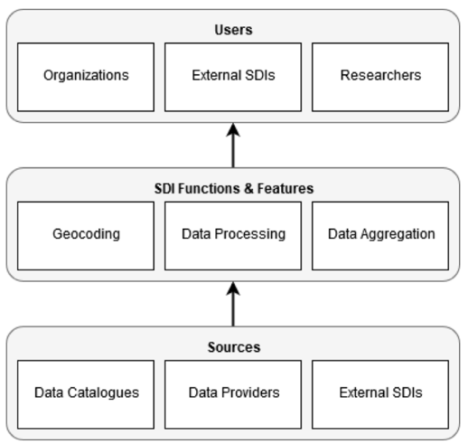
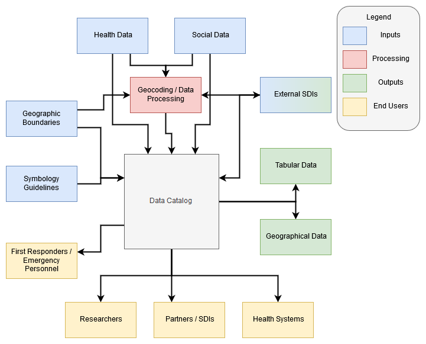

== Health SDI Architecture Framework

A generic data workflow for a Health SDI is shown in Figure 1 below which is aligned with the architectural approach presented in http://gsdiassociation.org/images/publications/cookbooks/SDI_Cookbook_from_Wiki_2012_update.pdf[The SDI Cookbook], developed with the support of the Global Spatial Data Infrastructure community. Alternate workflows and architectures are certainly possible to accomplish specific goals. 

.Simple Health Architecture.

The first step in building an SID is to identify providers and sources of relevant data. U.S. health datasets can be retrieved from organizations including the http://cdc.gov/[Centers for Disease Control and Prevention (CDC)], http://cms.gov/[Centers for Medicare and Medicaid Services (CMS)], and the http://hhs.gov/[Department of Health and Human Services (HHS)].  U.S. social datasets can be retrieved from the Census Bureau (Census) and http://bls.gov/[Bureau of Labor and Statistics (BLS)] among others.  Global datasets can be accessed from the https://www.un.org/en/[United Nations (U.N.)]; the https://www.who.int/[World Health Organization (WHO)] and its regional organizations, such as the https://www.paho.org/hq/index.php?lang=en[Pan American Health Organization (PAHO)]; from national level health departments and data portals, such as the https://bayanat.ae/en[Bayanat.ae] data portal of the United Arab Emirates, and a host of others. Additional sources of data include health Registries, disease-specific healthcare industry organizations and affinity-groups, university and research organizations as well as other public and private organizations that make data available for public consumption.

Geocoding, processing, and aggregating the curated and harvested data results in a catalog, or an SDI, with a theme of health. This centralized catalog of health and non-health data that is relevant to health outcomes is valuable in and of itself. It provides an invaluable resource into population health status as well as aids research into the causes of and potential remedies for health challenges facing populations. 

A Health SDI can provide tremendous additional value by supporting applications leveraging the data and geospatial tech to address specific challenges. An overall workflow for supporting and hosting such applications is shown in Figure 2 below.  

[[Health_SDI_Complex_Architecture-img]]
.Generalized Health SDI Architecture.

Data from the Health SDI can be retrieved, in tabular or geographical data formats (when available), can be geocoded (when and as necessary), and prepared for analysis. Analysis of the data can include leveraging analytical tools, including commercial tools such as Tableau, or opensource tools such as R and Python. Applications based on artificial intelligence machine learning algorithms such as regression, K-Nearest Neighbors, and decision trees can be utilized to perform in depth and complex analyses of geohealth data. Additionally, spatial statistics such as spatial autocorrelation through Moran's Spatial K-Nearest Neighbor analyses provides information on the clustering and spatial dispersion of observations.

Symbology guidelines for specific outputs can be addressed and the analyzed data or layer can be published to the Health SDI. Finally, resources on the Health SDI can be made available to users in numerous ways, potentially including but not limited to: 

*	Linking to a data provider
*	Direct download
*	Through OGC Open Standards including WFS and WMS 

Access can be open to the public or to private audiences through a username/password approach or through a variety of alternate security measures.

One value of an SDI, especially one utilizing Open Standards, is its ability to links to other SDIs, who themselves are engaged in aggregating, harvesting, and collecting data. This is especially valuable in the health field given concerns over the privacy and confidentiality of medical records. An institution with the medical records, such as a hospital, a health system, or an insurance company, can connect to a national or global Health SDI to leverage the population level data sets, to inform its research and data analytics without exposing personal medical records. 

Popular SDIs with catalogs including wide sets of data include GeoPlatform.gov and AmeriGEOSS. NextGEOSS is the European equivalent to AmeriGEOSS. This ability to connect to existing SDIs provides immediate access to large and diverse sets of data.  So, it isn’t necessary to do a lot of building to build an expansive SDI - under the caveat that you build following open standards.

=== Future Work

This white paper has attempted to lay out the case for the development of a Global Health SDI, discussing specific applications where such a solution can be helpful. In the process, the current market requirements as well as the current state of the art are identified, at least in part. Additional challenges to be certain are likely to be encountered in the process of establishing a Health SDI that can serve the world. The next steps in this process of achieving this goal may be to identify the open data standards that will be involved and the creation of a documented profile for implementation that can guide the implementation and establishment of a Health SDI. Its also possibly that some existing standards may need to be update to accomodate the needs of the healthcare sector or new standards created. The OGC's concept developmnt pilots and Testbeds form an effective mechanism for accomplishing these tasks and identifying and addressing any additional potential road block towards the construction of Health SDI. 

